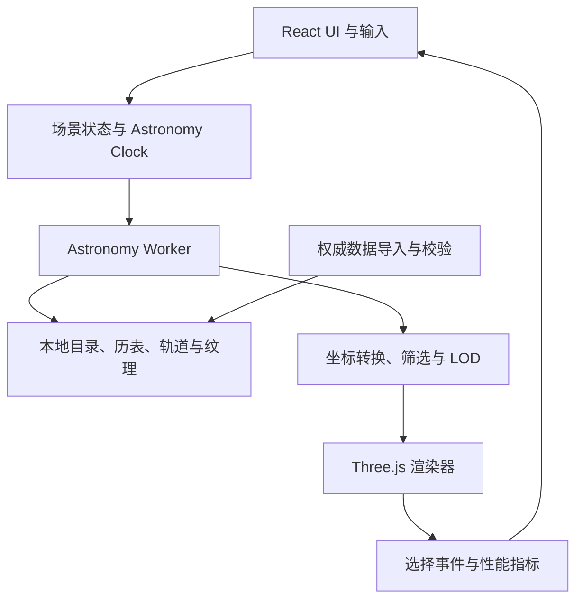

# 太阳系真实 3D 导览系统设计

**状态：**用户已确认方案（2026-09-30）  
**日期：**2026-09-30

## 1. 目标与范围

构建一个浏览器原生、可用于航天展览和科技馆的太阳系 3D 导览系统。首个可运行版本（MVP）包含太阳、八大行星、月球、土卫六（Titan）、冥王星和一组来自真实轨道根数的主带小行星示例，并支持统一模拟时间、轨道计算、目标搜索与选择、平滑飞行、轨道显示、天体信息和三种空间尺度。

项目按阶段扩展到主要卫星、矮行星、小天体目录、GPU 批量渲染、导览和展览部署。目录完整性与同时渲染数量分离：数据导入可覆盖不断变化的公开目录，实时显示按筛选、视锥、重要性和距离决定。

### 成功标准

- 输入日期或调整时间速度后，主要天体位置随模拟时间变化。
- 搜索并选择 Earth、Moon、Saturn、Titan 等已收录对象时，可飞向目标并显示数据面板。
- 开启小天体层时，MVP 显示一组源于已记录轨道根数的主带小行星；后续逐步扩大目录。不得以随机点或圆形动画伪装真实对象。
- 所有空间尺度、位置计算模式、数据来源和时间覆盖范围均可识别。
- MVP 可离线启动；数据更新失败不影响已验证数据继续使用。
- 主流展览 PC 以 60 FPS 为目标，最低可接受 30 FPS，并可动态降低画质。

## 2. 用户体验与界面

采用设计参考图中的深色宇宙风格：左侧天体目录与搜索，中部交互式 3D 场景，右侧天体信息面板，底部模拟时间轴和速度控制，顶部图层、视角及尺度控制。初次进入提供清晰的“进入太阳系”入口；支持键鼠、触摸和全屏展览模式。

界面能力包括：

- 天体分类目录、别名搜索、筛选和目标锁定。
- 自由飞行、轨道观察、跟随目标与首页概览相机。
- 时间播放、暂停、反向、倍速和日期跳转。
- 天体、轨道、标签、小行星带等图层开关。
- 天体事实、轨道参数、物理性质及数据来源信息。
- Scientific Scale、Visible Scale、Exhibition Scale；非真实比例必须有持续可见的提示。
- 加载进度、离线状态、数据错误降级和展览自动恢复。

## 3. 系统架构



模块职责：

1. **React UI**：搜索、目录、时间控件、信息面板、图层控制和可访问性。
2. **场景状态**：当前目标、相机模式、比例模式、可见层、模拟时间和质量等级。
3. **Astronomy Worker**：天文时标转换、历表查询、Kepler 传播、目录筛选和搜索索引；不得在主线程逐个更新大量天体。
4. **天文数据层**：版本化目录、位置采样、轨道根数、纹理元数据和来源记录。
5. **场景引擎**：相机、天体实例、轨道、标签、LOD、浮动原点和资源释放。
6. **数据管道**：从权威来源导入、规范化、验证单位/历元/参考系，生成应用可读数据包。

## 4. 天文计算与时间

### 4.1 双模式传播

- **历表模式**：太阳系主要天体、月球、重点卫星和特别展示目标使用 JPL Horizons 或基于 SPICE 的位置数据。数据通过构建/更新管线预生成，并记录参考系、时间尺度、起止时间、采样间隔、来源和更新时间。客户端插值查询，不在每帧访问在线服务。
- **Kepler 目录模式**：小行星、彗星、TNO 等采用权威目录的六根数与历元，以椭圆/双曲轨道求解传播。传播计算在 Worker 中进行，可按需计算和批量更新。
- 若历表超出覆盖时间或数据不可用，显示降级状态并按明确标记的 Kepler 模式回退；不得把估算位置标成精密实时历表。

Kepler 流程：由模拟时刻和历元求平近点角，迭代求解 Kepler 方程得到偏近点角，计算轨道平面位置，再用升交点经度、近地点幅角及倾角旋转到指定惯性坐标系。角度内部统一为弧度，距离统一为 km，内部日期用 Julian Date。核心公式来源与误差验证需在代码注释和 `docs/astronomical-model.md` 中注明。

### 4.2 Astronomy Clock

统一维护 UTC 显示时间、TDB Julian Date、速度倍率和暂停状态。支持实时、暂停、反向、分钟/小时/日/年级倍速以及日期输入。UI 日期以 UTC 显示。需要显式处理 UTC 与 Horizons/SPICE 所需时间尺度间的转换，不将 UTC、TDB 和 ET 混用。

### 4.3 坐标与精度

- 天文计算采用 km 的 Float64 位置，并明确参考框架（首选 ECLIPJ2000；历表源参考框架须记录并转换）。
- 场景绘制映射到 Three.js Y-up 坐标；转换由单独模块实现并以已知向量测试。
- 每帧采用相机相对坐标；必要时以相机附近作为浮动原点重定位。GPU 接收 Float32 局部坐标。
- 行星自转轴和自转周期单独建模，不以固定旋转增量冒充天文时间。

## 5. 数据来源与更新

优先来源：

- NASA/JPL Horizons API：重要天体历表和查询。
- NAIF SPICE：SPK 历表与必要的时间/参考系/姿态内核。
- Minor Planet Center Orbits API 和批量轨道文件：小天体轨道根数。
- NASA NSSDCA/JPL 物理参数页面：天体物理参数和轨道参数说明。
- NASA/USGS 公开纹理：贴图；每项资源记录来源、许可、分辨率和校验和。

参考文档：

- [JPL Horizons 手册](https://ssd.jpl.nasa.gov/horizons/manual.html)
- [JPL Horizons API 文档](https://ssd-api.jpl.nasa.gov/doc/horizons.html)
- [NAIF SPK Required Reading](https://naif.jpl.nasa.gov/pub/naif/toolkit_docs/C/req/spk.html)
- [MPC Orbits API 教程](https://docs.minorplanetcenter.net/tutorials/notebooks/mpc_tutorial_api_orbits/)
- [NASA 行星事实表说明](https://nssdc.gsfc.nasa.gov/planetary/factsheet/fact_notes.html)

更新脚本应输出带版本和来源的标准 JSON/二进制文件，先验证再原子替换。运行时使用本地数据；在线更新失败时保留当前有效版本。不得在应用中硬编码易变化的天体数量。

## 6. 核心类型

```ts
type BodyType =
  | "star" | "planet" | "dwarfPlanet" | "moon"
  | "asteroid" | "comet" | "tno" | "spacecraft";

interface CelestialObject {
  id: string;
  name: string;
  officialName?: string;
  aliases?: string[];
  type: BodyType;
  parentId?: string;
  radiusKm?: number;
  massKg?: number;
  densityKgM3?: number;
  rotationPeriodHours?: number;
  axialTiltDeg?: number;
  orbit?: OrbitalElements;
  ephemeris?: EphemerisReference;
  texture?: TextureReference;
  source: string;
  sourceUpdatedAt?: string;
}

interface OrbitalElements {
  epochJD: number;
  semiMajorAxisKm: number;
  eccentricity: number;
  inclinationRad: number;
  longitudeAscendingNodeRad: number;
  argumentOfPeriapsisRad: number;
  meanAnomalyRad: number;
  elementFrame: "ECLIPJ2000" | "ICRF";
}

interface EphemerisReference {
  datasetId: string;
  frame: "ECLIPJ2000" | "ICRF";
  timeScale: "TDB";
  validFromJD: number;
  validToJD: number;
  source: string;
}

interface TextureReference {
  low?: string;
  medium?: string;
  high?: string;
  attribution: string;
  license: string;
}

interface SimulationTime {
  utc: string;
  julianDateTdb: number;
  speed: number;
  paused: boolean;
}
```

## 7. 技术栈与渲染

- React + TypeScript strict + Vite：应用和开发构建。
- Three.js：3D 渲染，渲染循环和对象生命周期由独立场景模块控制。
- Web Worker：天文计算、时间推进、小天体筛选及搜索索引。
- InstancedMesh/BufferGeometry：同类小天体和星点批量绘制，避免每个对象一个 React 组件或独立 draw call。
- Vitest：时间、单位、坐标和轨道算法单元测试；Playwright：搜索、飞行、控制和尺度验收。
- 纹理低清优先，近景逐级加载；仅对必要天体启用高分辨率和后处理。

## 8. 空间尺度与视觉规则

1. **Scientific Scale**：距离和半径均真实比例。
2. **Visible Scale**：保留轨道尺度，放大行星半径；持续显示“天体尺寸已视觉增强”。
3. **Exhibition Scale**：使用明确标注的非线性距离压缩；图例和比例尺同步解释。

天体颜色、发光、光晕和大小不能暗示错误物理数据。太阳是太阳系唯一恒星；背景恒星层需独立标识为太阳系外背景。

## 9. 初始目录结构

```text
src/
  app/
  ui/{components,panels,controls}/
  scene/{renderer,camera,bodies,orbits,labels,lod}/
  astronomy/{clock,coordinates,kepler,ephemeris,units}/
  workers/
  data/{catalog,ephemeris,textures}/
  state/
  i18n/
scripts/{import-horizons,import-mpc,validate-data}/
tests/{astronomy,ui,e2e}/
docs/
  architecture.md
  astronomical-model.md
  coordinate-system.md
  data-sources.md
  performance.md
  exhibition-deployment.md
```

## 10. 阶段和验收

### MVP

太阳、八大行星、月球、土卫六和冥王星；本地基础数据、历表/Kepler 接口、时间控制、可视化轨道、相机模式、搜索、FlyTo、信息面板、尺度切换及深色 UI。通过 10 个核心场景：进入、选择地球/月球、倍速、搜索 Saturn/Titan、小行星图层、外太阳系、尺度切换和日期跳转。

### Phase 2

加入更多主要卫星（包括木星伽利略卫星与其他土星卫星）、矮行星、重点小行星和彗星，扩充本地数据源与信息面板。

### Phase 3

接入批量小天体目录，完善 Worker 传播、视锥/距离筛选、GPU instancing、柯伊伯带和 TNO。

### Phase 4

加入真实恒星背景数据层、导览路线、科学模式、自动展演和触控导览。

### Production

展览设备验证、4K 动态画质、离线部署、可恢复运行、资源泄漏监控、数据更新运维说明和版权清单。

## 11. 性能目标与监测

初始工程预算，须以目标展览硬件的实测作为发布依据：

| 指标 | 目标 |
|---|---:|
| 可见主要天体 | 约 100 个以内 |
| 可筛选目录 | 渐进加载；目录规模与可见对象数分离 |
| 主场景 draw calls | 小于 100 |
| 帧率 | 目标 60 FPS，最低 30 FPS |
| 初始纹理内存 | 约 256 MB 以内，近景纹理按需加载 |
| 动态质量选项 | Ultra / High / Medium / Performance |

开发 HUD 监控帧率、帧时间、draw calls、三角形、可见对象、纹理内存估算、Worker 时间和轨道更新时间。质量控制可调整像素比、轨道采样、星点密度、后处理和小天体显示量。

## 12. 风险与降级

| 风险 | 控制措施 |
|---|---|
| 历元/时间尺度/参考系混淆 | 导入校验、类型化元数据和坐标转换测试 |
| 历表覆盖范围不足 | 显示有效时间区间，按标注的 Kepler 模式回退 |
| 浮点精度损失 | CPU Float64、相机相对 Float32 和浮动原点 |
| 目录规模超出浏览器预算 | Worker、渐进加载、视锥筛选和实例化绘制 |
| 展示尺度误导 | 常驻尺度标记、比例尺和图例 |
| 网络/数据更新不可用 | 本地版本化数据、原子更新、回滚到上个有效版本 |
| 长时间运行资源泄漏 | 统一清理 GPU 资源、监听器和 Worker；运行时健康监测 |
| 设备 GPU 能力不一 | 启动能力检测、画质档位和动态降级 |

## 13. 交付物

源码、可运行 Web 应用、天文计算模块、Three.js 场景、UI、版本化示例数据、Horizons/MPC 导入及验证脚本、测试、README、部署配置和上述 `docs/` 文档。README 必须说明数据来源、许可证、比例和视觉增强、坐标系、轨道模型、性能策略、浏览器要求、展览部署与离线运行。

## 14. 设计决策记录

- 使用预生成并本地缓存的重要天体历表，避免渲染依赖外部在线服务造成展览中断。
- 使用 MPC 轨道根数传播大目录，避免为每颗小天体长期保存高密度历表。
- 使用 Three.js imperative scene + React UI，确保 GPU 对象管理和界面组件职责分离。
- MVP 先完成端到端科学与交互闭环，并以少量有真实轨道根数的主带小行星验收轨道层；后续阶段扩展目录和展览功能，避免在没有验证性能前承诺完整小天体集实时渲染。
