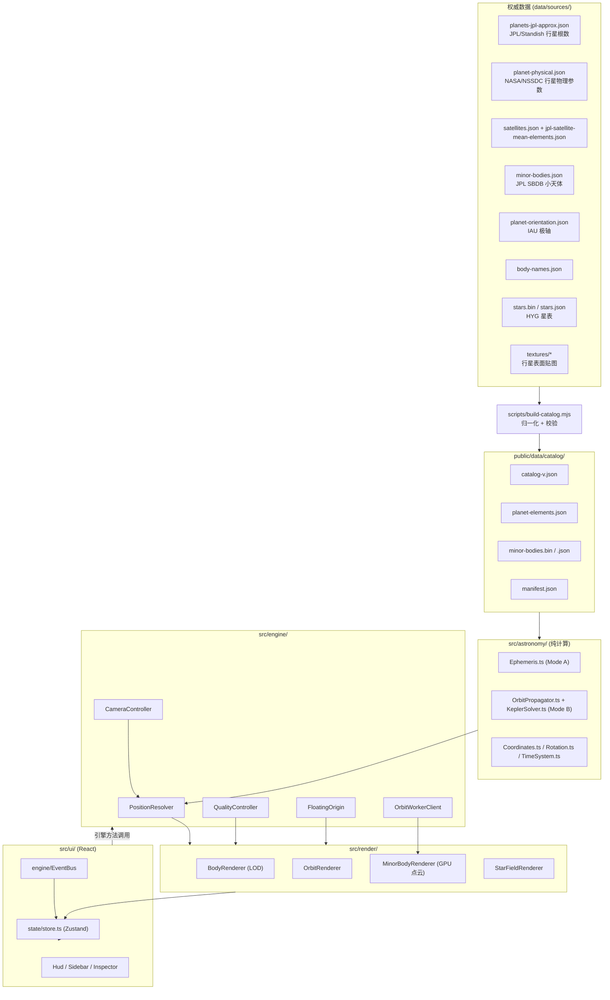

# 太阳系 · 真实三维导览 (Solar System Explorer)

一个面向展陈（博物馆 / 科技馆 / 大屏）的实时三维太阳系导航系统。所有天体位置由真实的轨道数据与历表计算得到，不使用随机动画或装饰性圆环；任何无法溯源的比例、相位或尺寸都会在界面上显式标注。

- 技术栈：TypeScript、React 19、three.js（WebGL 2）、Zustand、MiniSearch、Vite、Vitest。
- 位置计算：`astronomy-engine`（VSOP87 / ELP2000）与自研的开普勒轨道传播器。
- 数据管线：`data/sources/`（权威数据）→ `public/data/catalog/`（归一化目录）→ Web 应用，全部离线可用。

本 README 说明项目结构、数据来源、坐标系、轨道模型、尺度约定、性能策略与部署方式。更细的专题文档见：

- `docs/architecture.md` — 模块架构、数据流、事件总线、引擎生命周期
- `docs/astronomical-model.md` — 两套位置模型、开普勒方程、验证方法与实测误差
- `docs/coordinate-system.md` — 坐标帧、转换矩阵、浮动原点
- `docs/data-sources.md` — 每个数据源的 URL、许可、摄取脚本与字段映射
- `docs/performance.md` — 画质档位、LOD、Worker 协议、性能面板字段
- `docs/exhibition-deployment.md` — 离线部署、`exhibition.config.json`、触摸/4K、预检清单

---

## 1. 架构总览



数据流为单向：UI 动作调用引擎方法，引擎通过 `EventBus`（`src/engine/EventBus.ts`）发布事件，事件写入 Zustand store，React 再按 store 渲染。React 层不持有任何 three.js 对象（见 `src/state/store.ts` 顶部注释）。

---

## 2. 快速开始

```bash
npm install          # 安装依赖
npm run dev          # 开发服务器 (Vite)
npm run build        # tsc -b && vite build，产物在 dist/
npm run preview      # 预览构建产物，--host 0.0.0.0 --port 4173
npm test             # vitest run（当前 4 个测试文件 / 60 个用例）
npm run typecheck    # tsc -b --force
```

数据管线脚本（详见第 5 节）：

```bash
npm run data:minor-bodies   # node scripts/update-minor-bodies.mjs
npm run data:planets        # node scripts/update-planets.mjs
npm run data:satellites     # node scripts/update-satellites.mjs
npm run data:stars          # node scripts/update-stars.mjs
npm run data:textures       # node scripts/update-textures.mjs
npm run data:build          # node scripts/build-catalog.mjs（离线，仅合并校验已有数据）
npm run data:all            # 依次运行以上全部
```

`npm run verify:ephemeris` 运行 `scripts/verify-ephemeris.mjs`：这是一个**独立的科学验证脚本**，在 6 个历元（1900–2049）上把 Mode B 的开普勒行星位置与 Mode A 的高精度历表逐颗比较，输出径向误差、三维位置误差、角误差与速度误差，并在超出公开精度阈值时以非零码退出（可用于 CI 回归）。

同一结论也由 `src/astronomy/__tests__/EphemerisValidation.test.ts` 通过 `npm test` 覆盖，见第 8 节。

端到端验收（可选）：`scripts/smoke-test.mjs` 用真实浏览器跑完项目要求中的十个验收场景，并对引擎自身的诊断数据断言（不依赖像素比对），截图写入 `/tmp/shots`。它需要的 `playwright-core` 与浏览器**不是**本项目的依赖，按需安装：

```bash
npm i -D playwright-core && npx playwright-core install chromium
npm run dev            # 另开一个终端
npm run smoke-test
```

`npm run verify:all` 依次执行 typecheck、单元测试、科学验证与生产构建。

依赖（`package.json`）：`astronomy-engine ^2.1.19`、`minisearch ^7.1.2`、`react ^19.2.8`、`react-dom ^19.2.8`、`three ^0.181.0`、`zustand ^5.0.8`；构建期 `typescript ~6.0.2`、`vite ^8.3.0`、`vitest ^3.2.4`。

---

## 3. 数据来源与许可

| 数据 | 来源 URL | 许可 | 提供内容 | 摄取脚本 |
| --- | --- | --- | --- | --- |
| 行星轨道根数（Mode B） | https://ssd.jpl.nasa.gov/planets/approx_pos.html | NASA/JPL 公有领域 | JPL/Standish 1992 近似位置根数（1800–2050） | 无（人工策展表 `data/sources/planets-jpl-approx.json`，由 `build-catalog.mjs` 读取） |
| 行星物理参数 | https://nssdc.gsfc.nasa.gov/planetary/factsheet/ | NASA/NSSDC 公有领域 | 半径、质量、密度、重力、GM、自转周期、轨道概要 | `scripts/update-planets.mjs` |
| 天然卫星平均轨道要素 | https://ssd.jpl.nasa.gov/sats/elem/ | NASA/JPL 公有领域 | 卫星 a、e、i、ω、M、Ω、周期、参考面、母天体极轴 | `scripts/update-satellites.mjs`（读取 `data/sources/jpl-satellite-mean-elements.json`） |
| 卫星物理参数与其余卫星 | joviansatfact / saturniansatfact / uraniansatfact / neptuniansatfact / marsfact / plutofact / moonfact（同为 NSSDC 域名） | NASA/NSSDC 公有领域 | 卫星半径、质量、密度、反照率、轨道几何 | `scripts/update-satellites.mjs` |
| 小天体（约 1.1 万） | https://ssd-api.jpl.nasa.gov/sbdb_query.api | NASA/JPL 公有领域 | 密近根数（a/e/i/Ω/ω/M、历元、近日点时刻）、H、直径、反照率、自转周期 | `scripts/update-minor-bodies.mjs` |
| 恒星背景（15 598 颗） | https://github.com/astronexus/HYG-Database（hygdata_v41.csv） | CC BY-SA 4.0 | 赤经、赤纬、视星等、B−V 色指数、命名恒星 | `scripts/update-stars.mjs` |
| 行星自转极轴 | IAU WGCCRE / NAIF 行星常数 | IAU/NAIF（公有领域常数） | J2000 极轴 R.A./Dec.、自转相位来源标记 | 无（人工策展表 `data/sources/planet-orientation.json`） |
| 命名与发现记录 | IAU / NASA-JPL | 公有领域 | 中英文名、官方名称、别名、发现时间与发现者 | 无（人工策展表 `data/sources/body-names.json`） |

生成目录（`public/data/catalog/`，版本 `v20260929`）包含**版本化目录** `catalog-v20260929.json`、`planet-elements.json`、`minor-bodies.json`、`minor-bodies.bin` 与 `manifest.json`。`manifest.json` 通过顶层字符串字段 `catalogFile`（`"catalog-v20260929.json"`）指向当前目录文件，运行时 `src/data/CatalogLoader.ts` 读取该字段，因此一次数据刷新会写入新的不可变文件，而不会覆盖浏览器可能仍在缓存的旧文件。`manifest.json` 与目录内每个天体都带有 `sourceUpdatedAt`（上游数据集中最新的 `retrievedAt`，当前 `2026-09-29T09:57:32.128Z`），用于标明数据年龄。构建**不再**写出非版本化的 `catalog.json`。恒星与贴图为 `public/data/stars/*` 与 `public/data/textures/*`。

---

## 4. 更新天文数据

管线分为两层：联网抓取权威数据 → `data/sources/*.json`；`scripts/build-catalog.mjs` **不联网**，只合并与校验，输出运行时目录。

| npm 脚本 | 作用 | 是否联网 |
| --- | --- | --- |
| `npm run data:minor-bodies` | JPL SBDB 查询 API → `data/sources/minor-bodies.json`（唯一下载小天体的步骤） | 需要网络 |
| `npm run data:asteroids` | 从上述文件离线切分出小行星族 → `data/sources/asteroids.json`（mainBelt / nearEarth / trojan / centaur / tno） | 离线 |
| `npm run data:comets` | 从上述文件离线切分出彗星桶 → `data/sources/comets.json` | 离线 |
| `npm run data:planets` / `data:satellites` / `data:stars` / `data:textures` | NASA/NSSDC fact sheet、JPL 卫星平均要素、HYG 星表、Solar System Scope 贴图 | 需要网络 |
| `npm run data:build` | 合并与校验 → `public/data/catalog/catalog-<版本>.json` + `manifest.json`（含 `catalogFile`、`sourceUpdatedAt`） | 离线 |
| `npm run generate:ephemeris` | 下载 JPL Horizons 外部基准矢量 → `data/sources/horizons-golden.json` | 需要网络 |
| `npm run data:all` | 依次执行上述抓取、切分与构建 | 混合 |

```bash
# 抓取（需要网络；Node 全局 fetch 可通过 NODE_USE_ENV_PROXY=1 走代理）
NODE_USE_ENV_PROXY=1 node scripts/update-minor-bodies.mjs
NODE_USE_ENV_PROXY=1 node scripts/update-planets.mjs
NODE_USE_ENV_PROXY=1 node scripts/update-satellites.mjs
NODE_USE_ENV_PROXY=1 node scripts/update-stars.mjs
NODE_USE_ENV_PROXY=1 node scripts/update-textures.mjs

# 离线切分（读取上一步的 minor-bodies.json，不联网；各自打印真实数量）
node scripts/update-asteroids.mjs
node scripts/update-comets.mjs

# 归一化 + 校验（离线运行，打印校验结果）
node scripts/build-catalog.mjs

# 外部科学基准（需要网络；离线机器会写出 status="unavailable" 的占位文件而非编造数据）
node scripts/generate-ephemeris.mjs
```

`scripts/lib/io.mjs` 提供带重试的 `httpText`（4 次重试、60 s 超时、`user-agent`）与最小 HTML 表格解析器；`update-*` 脚本分别从 NASA/NSSDC fact sheet、JPL SBDB API、HYG CSV 解析出结构化 JSON。`scripts/generate-ephemeris.mjs` 另带 `--self-test`，可在无网络时校验 Horizons `$$SOE/$$EOE` 文本表的解析器（合成格式样本，不写入任何数据）。

---

## 5. 贴图来源与许可

贴图由 `scripts/update-textures.mjs` 下载到 `public/data/textures/`（`public/data/textures/textures.json` 记录来源、许可与字节数；当前总计 8 140 210 字节）：

- Solar System Scope 行星表面图（`2k_*.jpg`、`2k_saturn_ring_alpha.png`、`2k_stars_milky_way.jpg`）：**CC BY 4.0**，派生自 NASA/USGS 影像，允许离线随展项分发。
- 地球法线图与镜面图（`earth_normal_2048.jpg`、`earth_specular_2048.jpg`）：取自 three.js 官方示例，**MIT**。

运行时行为（`src/data/TextureProvider.ts`）：

- **随包离线分发的地图**：Solar System Scope 的 2k 行星/卫星表面图（`public/data/textures/*.jpg`）与土星环 alpha 图；其中地球另有 three.js 官方示例的法线图与镜面图。也就是说，展项在断网时使用的地图全部来自上述两个来源，没有"下载自任意网络图片"的情况。
- **惰性请求**：启动阶段不请求任何贴图；某个天体首次进入**贴图 LOD**（投影半径 ≥ 5 px，见 `docs/performance.md`）时才发起该天体的贴图请求，并在缓存中复用。
- **画质档位决定分辨率层级**：离线包为 2048 px（2k）资源，`ultra` 与 `high` 档按原生 2048 px 使用，`medium` 档在加载时降采样到 1024 px，`performance` 档降采样到 512 px（`TEXTURE_MAX_WIDTH`）。分辨率层级是加载期一次性处理，不会在运行时反复切换。
- **缺失或加载失败 → 确定性程序化贴图**：某天体声明的地图文件不存在、或请求/解码失败时，使用由天体 id 哈希生成的确定性程序化地图，并在信息面板明确标注“程序化贴图”，绝不冒充实拍影像。

贴图缓存上限 48 项并显式 `dispose()`，避免长时间无人值守运行时 GPU 内存增长。

---

## 6. 坐标系

系统内部同时在四个帧中工作（详细推导见 `docs/coordinate-system.md`）：

- **日心黄道 J2000（HEJ2000）**：+X 指向 J2000 春分点，+Z 指向北黄极，+Y 构成右手系。这是所有 `BodyState.heliocentricKm` 的帧。
- **赤道 J2000（EQJ）**：`astronomy-engine` 返回向量的帧，经 `Rotation_EQJ_ECL` 旋入黄道。
- **天体固连帧（IAU/NAIF）**：以天体 IAU 北极（R.A./Dec.）为 +Z，+X 位于天体赤道与 J2000 赤道的升交点。
- **Three.js 场景帧**：右手、Y 向上的纯旋转映射 `scene.x = ecl.x, scene.y = ecl.z, scene.z = −ecl.y`（`ECLIPTIC_TO_SCENE`，行列式 +1）。

所有位置在引擎内部以 **float64 千米**保存；渲染时按 `renderPosition = warp(bodyPosition) − warp(cameraPosition)` 写入 float32（浮动原点，`src/engine/FloatingOrigin.ts`）。three.js 相机永远位于原点，仅其朝向由虚拟相机位置推导；GPU 从不接收大坐标，因此 1×10⁻⁴…1×10⁹ 的 near/far 范围可以正常工作（`SceneRenderer` 启用 `logarithmicDepthBuffer`，见 `src/engine/Renderer.ts`）。

---

## 7. 轨道模型：Mode A 与 Mode B

每个天体在目录中带有 `positionModel` 字段（`src/types/catalog.ts`），取值为 `origin | ephemeris | kepler`。

### Mode A — 高精度历表（`positionModel: "ephemeris"`）

- 覆盖：太阳、八大行星、月球、冥王星（共 11 个天体）。
- 库/算法：`astronomy-engine`，内部为 **VSOP87**（行星）、**ELP2000-82B**（月球）以及拟合 JPL DE 的冥王星级数。
- 实现：`src/astronomy/Ephemeris.ts` 的 `AstronomyEngineEphemerisSource`；结果是日心黄道 J2000 位置的**公里**值，按 `(body, JD)` 记忆化。
- 地球/月球：`HelioVector(Earth)` 已由引擎解析地月质心（EMB）分裂；月球位置由 `GeoMoon` 加地球日心位置得到。
- 声明精度（`Ephemeris.ts` 注释）：内行星与 DE 派生位置在弧分级别吻合，外行星更好。

### Mode B — 开普勒轨道传播（`positionModel: "kepler"`）

- 覆盖：约 10 984 个小天体、5 个矮行星中除冥王星外的 4 个（Ceres/Eris/Haumea/Makemake）、163 颗未被 Mode A 覆盖的天然卫星。
- 数据：行星用 `public/data/catalog/planet-elements.json` 中的 JPL/Standish 根数；小天体用 JPL SBDB 的密近根数；卫星用 JPL 平均轨道要素。
- 算法：`src/astronomy/KeplerSolver.ts` + `OrbitPropagator.ts`。椭圆分支解 `M = E − e·sin E`（初值 `E₀ = M + e·sin M`，Newton 迭代，容差 1e-13）；双曲分支解 `M = e·sinh H − H`（初值 `H₀ = asinh(M/e)`）。由近焦点系到黄道系用 `r = Rz(−Ω)·Rx(−I)·Rz(−ω)·r'`。
- 平均运动：优先使用目录中的恒星周期 `n = 2π/P`（`meanMotionRadPerDayOverride`），因为它精确复现公开周期；仅对无周期的双曲轨道才用 GM 推出的两体速率。
- 参考面：行星黄道面；规则卫星用局部 Laplace 面（接近母行星赤道面）；不规则卫星用 J2000 黄道面。
- 地月质心分裂（`src/astronomy/PlanetElements.ts`，质量比 μ = 0.0123000371，DE430）：`Earth = EMB − r_moon/(1+μ)`，`Moon = EMB + μ·r_moon/(1+μ)`。

JPL 公布的元素精度（1800–2050，日心黄经/黄纬/距离）：水星 15″/1″/1000 km，金星 20″/1″/4000 km，EMB 20″/8″/6000 km，火星 40″/2″/25000 km，木星 400″/10″/600000 km，土星 600″/25″/1500000 km，天王星 50″/2″/1000000 km，海王星 10″/1″/200000 km。

细节与实测误差见 `docs/astronomical-model.md`。

---

## 8. 尺度说明（三种模式，与 `src/data/ScaleModel.ts` 完全一致）

太阳系在距离上横跨约 13 个数量级、半径约 7 个数量级，任何单一线性映射都无法既真实又可读。系统提供三种**显式命名**的模式，当前模式始终显示在 HUD 上，且任何非真实比例都会在信息面板逐项披露。

| 模式 | 距离映射 | 半径映射 | 距离是否真实 | 半径是否真实 |
| --- | --- | --- | --- | --- |
| `scientific` 科学尺度 | 1 场景单位 = 1000 km | 1 场景单位 = 1000 km | 是 | 是 |
| `visible` 科普尺度 | 1 场景单位 = 1000 km（线性） | 压缩幂律放大 | 是 | 否（视觉增强） |
| `exhibition` 展览尺度 | 非线性（50 AU 内平方根，之外对数） | 更强的半径放大 | 否（非线性映射） | 否（视觉增强） |

关键实现常量（`src/data/ScaleModel.ts`）：

- `KM_PER_UNIT = 1000`：线性模式的统一比例，**距离与半径在科学尺度下都是 1 单位 = 1000 km**，不做任何夸张；在总览距离下行星确实是亚像素的。
- 半径压缩幂律：`radiusUnits = gain · R^0.45 · R_earth^0.55 / 1000`，指数 `POWER_LAW_EXPONENT = 0.45`（越小压缩越强）。`visible` 档增益 `VISIBLE_RADIUS_GAIN = 12`；`exhibition` 档按天体类别增益：恒星 4、行星/矮行星/卫星/小天体 14（`EXHIBITION_RADIUS_GAIN`）。最小渲染半径 `MIN_BODY_RADIUS_UNITS = 0.02`。
- 展览距离映射：`r ≤ 50 AU` 时 `units = 0.14·√(r_km)`，`r > 50 AU` 时 `units = 边界 + 2400·ln(r_km / 50 AU)`。标定后 1 AU ≈ 1712 单位、水星 ≈ 1066 单位（舒适地位于太阳渲染半径之外）、海王星 ≈ 1.3×10⁴ 单位，柯伊伯带边缘落在约 1.7×10⁴ 单位的总览范围内。
- **卫星系统增强因子**（`satelliteSystemFactor`）：每个母天体只用一个因子，作用于该母天体所有卫星的“母天体相对偏移”，从而精确保留卫星之间的相对间距。因子 `max(1, 最小卫星偏移/(4·母天体渲染半径))`，其中 `SATELLITE_CLEARANCE_FACTOR = 4` 保证最内侧卫星至少位于母天体 4 个半径之外。**在科学尺度下该因子恒为 1**，卫星处于真实位置（`PositionResolver.satelliteFactorFor` 对 `scientific` 直接返回 1）。
- `radiusMagnification()` 返回半径相对真实映射的放大倍数，HUD 与信息面板据此显示“真实尺寸 / ×N 放大”；`formatMagnification` 在放大 < 1.05 时显示“真实尺寸”。

### 什么才是真实比例，什么是视觉增强（重要）

**真实（未做任何夸张）的部分：**

- 所有天体的**轨道位置与公式**：Mode A 来自历表，Mode B 来自真实密近根数；不存在随机或装饰性运动。
- 在 `scientific` 与 `visible` 模式下，**所有距离线性且真实**：1 场景单位 = 1000 km。
- 在 `scientific` 模式下，**天体半径也真实**（同样的 1000 km/单位）。
- 自转**速率**与**极轴指向**：来自 NASA/NSSDC 恒星自转周期与 IAU/NAIF 极轴，是真实数据。
- 行星环的内外边界：按公开的“行星赤道半径倍数”给出（如土星环 1.11–2.27 R），是几何而非美术。
- 天体表面贴图：随包离线分发的 Solar System Scope 地图（CC BY 4.0，派生自 NASA/USGS 影像）与 three.js 示例法线/镜面图（MIT）；贴图在进入贴图 LOD 时按需请求，画质档位决定 2048/1024/512 px 分辨率层级；声明的地图缺失或加载失败时回退为**确定性程序化贴图**，信息面板显示“程序化贴图”。绝不把程序化贴图冒充实拍影像。
- 小天体点云：每个点是一个真实编目天体的位置；颜色编码动力学族群，尺寸仅由绝对星等/直径编码（显示约定，已在图例说明）。

**被视觉增强或改变、并在 UI 中披露的部分：**

- `visible` 模式：**天体半径改为压缩幂律**（`gain·R^0.45·R_earth^0.55/1000`，增益 12），压缩动态范围：小于地球的天体被放大，极大天体（太阳）反而被压缩到真实尺寸以下；HUD 显示“天体尺寸已视觉增强”。
- `exhibition` 模式：**距离使用非线性映射**（50 AU 内 √，之外 ln），因此不再是真实比例；HUD 同时显示“天体尺寸已视觉增强 · 距离为非线性映射，非真实比例”。
- 卫星系统在非科学模式下被整体放大（每母天体一个因子），以保证卫星不被母天体吞没；相对间距保持真实。信息面板仍报告真实距离。
- 自转**相位**（而非速率/轴）是约定值：以 J2000 为零点（`rotationPhaseSource: "convention-zero-at-j2000"`），因为离线包未包含 IAU W0 多项式常数；信息面板明确说明“自转相位：以 J2000 为约定零点；自转速率与极轴指向为真实数据”。
- 无公开平近点角的卫星，其轨道**相位**是约定值（`phaseSource: "convention"`），信息面板显示“轨道相位：约定值（无公开平近点角）”。
- 无公开直径的矮行星（Eris、Haumea、Makemake）由绝对星等估算标记大小，信息面板显示 `暂无可靠数据`。

---

## 9. 性能策略

- **Worker 传播**：约 1.1 万小天体的开普勒求解全部在 Web Worker（`src/workers/orbit.worker.ts`）中进行，主线程不阻塞；Worker 不可用时自动回退到主线程传播（`src/engine/OrbitWorkerClient.ts`）。
- **GPU 点云**：小天体以单个 `Points` 一次 draw call 绘制，无 per-object 的 Object3D/Mesh/React 组件（`src/render/MinorBodyRenderer.ts`）。
- **LOD 分级**：天体视觉按**投影尺寸**（像素）而非固定距离分级 —— `point`（< 1.4 px，隐藏球体、显示标记点）、`low`（< 5 px）、`standard`、`close`（`distance < 半径·90` 且 > 40 px，启用大气壳、云层与环细节）。球体分段随画质档变化（ultra 128×96 … performance 32×24）。见 `src/render/BodyRenderer.ts`。
- **自适应画质**：`QualityController` 用 1.6 s 滑窗（≥12 样本）测帧率，目标 58 FPS、下限 40 FPS，带迟滞与 2.5 s 冷却，一次最多降一级（极低帧率时直降 performance 档）。画质影响像素比上限、bloom、大气、轨道采样数、小天体绘制上限与恒星数。
- **浮动原点**：见第 6 节；相机相对渲染保证 near/far 范围可用。
- **贴图按需加载**：见第 5 节。

各档位具体数值、Worker 协议与性能面板字段见 `docs/performance.md`。README 不给出真实硬件上的 FPS 数字，因为帧率取决于运行环境；代码实现的是上述目标与自适应机制。

---

## 10. 浏览器要求与降级行为

- **必须支持 WebGL 2**：新版 three.js 渲染器要求 WebGL 2（`package.json` 中 `three ^0.181.0`）。
- `src/engine/GraphicsCapability.ts` 依次探测 WebGL 2 → WebGL 1 → 无；`detectGraphicsCapability()` 返回 backend、renderer 字符串、是否支持 WebGPU 与错误信息。
- 若无法创建 WebGL 2，应用**不会白屏或崩溃**：`useEngine`（`src/ui/useEngine.ts`）在 `backend !== 'webgl2'` 时进入 `error` 阶段并显示可读提示（`degradationNotice`），中文提示要求启用硬件加速或更换支持 WebGL 2 的浏览器/驱动。
- `SceneRenderer` 监听 `webglcontextlost`（`preventDefault()` 以便浏览器尝试恢复）与 `webglcontextrestored`（重建全部 GPU 资源，而非刷新页面），并把这些事件转为 `contextLost` / `contextRestored` 通知（`src/engine/Renderer.ts`、`src/engine/SolarSystemEngine.ts`）。

---

## 11. 展览部署与离线运行

- 构建：`npm run build` 生成 `dist/`；用 `npm run preview -- --host 0.0.0.0 --port 4173` 或任意静态服务器托管。数据与贴图位于 `public/`，会被原样复制进 `dist/`，因此**完全离线可用**。
- 展陈参数集中在 `public/exhibition.config.json`，启动时通过 `src/data/ConfigLoader.ts` 拉取并与默认值合并；文件缺失/损坏不会致命（回退默认值）。
- 触摸与 4K：`src/styles/app.css` 使用 `--touch-min: 48px`、`clamp()`/`vw` 与 `@media (pointer: coarse)`（触屏下所有交互元素增至 48 px）、`@media (max-width: 1180px), (max-aspect-ratio: 1/1)`（侧栏收窄并隐藏图例）、`@media (prefers-reduced-motion: reduce)` 与 `.app[data-reduced-motion='true']`（减弱动效）、`@media (prefers-contrast: more)`（高对比度）。标签字号随视口缩放，4K 面板得到 4K 尺寸的标签。
- 自动演示 / 导览：`src/data/Tour.ts` 定义 13 站导览（`TOUR_STOPS`）与自动演示巡游（`AUTO_DEMO_STOPS`）；无操作 `autoDemoDelaySeconds`（默认 150 s）后进入自动演示，任意输入即退出。

部署细节、预检清单与配置字段见 `docs/exhibition-deployment.md`。

---

## 12. 数据校验结果（真实输出）

`scripts/build-catalog.mjs` 在构建时执行三项校验并写入 `public/data/catalog/manifest.json` 与版本化目录 `catalog-v20260929.json`（`manifest.catalogFile` 指向后者）。当前（`v20260929`）`manifest.validation.passed = true`，三项全部通过：

| 校验 | 说明 | 结果 |
| --- | --- | --- |
| `kepler-third-law (satellites)` | 用母天体 GM 依 `P = 2π√(a³/GM)` 预测周期，与目录周期比较 | 通过（比较 164 项）。规则卫星（Laplace 面）53 项，容差 3%，最差 Hyperion 2.049%；不规则卫星 + 冥王星系 111 项，容差 10%，最差 Halimede 7.679% |
| `radius-provenance` | 每个天体要么有公开半径，要么被显式标记为缺失，绝不编造尺寸 | 通过。无公开直径：`eris, haumea, makemake` |
| `planet-element-coverage` | 八大行星同时具备 JPL/Standish 根数与 Mode A 历表 | 通过（mercury…neptune） |

构建还会输出一条告警：Eris、Haumea、Makemake 无公开直径，渲染时按绝对星等估算大小，UI 显示 `暂无可靠数据`。

目录统计（`manifest.json` / `catalog-v20260929.json`）：总天体 11 162 = 渲染天体 178 + 小天体 10 984；按类型：恒星 1、行星 8、矮行星 5、卫星 164；小天体按族：主带 4 495、近地 1 676、特洛伊 1 558、TNO 1 600、半人马 500、彗星 1 155，其中双曲轨道 200；恒星 15 598（命名 366）；有公开相位的卫星 12。

### Mode B 行星 vs Mode A 历表实测误差

`src/astronomy/__tests__/EphemerisValidation.test.ts` 在 1900–2049 的 6 个历元上比较两套模型（`npm test` 会打印误差表）。实测最差误差：

| 天体 | 最差方向误差 | 最差径向误差 |
| --- | --- | --- |
| 水星 Mercury | 0.0079° | 0.0024 % |
| 金星 Venus | 0.0035° | 0.0032 % |
| 地球 Earth | 0.0037° | 0.0014 % |
| 火星 Mars | 0.0158° | 0.0089 % |
| 木星 Jupiter | 0.0851° | 0.0685 % |
| 土星 Saturn | 0.1534° | 0.1253 % |
| 天王星 Uranus | 0.0229° | 0.0403 % |
| 海王星 Neptune | 0.0152° | 0.0187 % |

JPL 表中地球条目是**地月质心**，Mode B 需用月球平均要素做质心分裂：`地球 = 质心 − μ/(1+μ)·r_月球`（μ = 月球/地球质量比 0.0123000371）。早前实现误用月球的系数 `1/(1+μ)`，把地球错位近一个地月距离（方向残差 0.1470°、径向 0.2688 %）；修正为 `μ/(1+μ)` 后残差降至 **0.0037° / 0.0014 %**，该系数由 `EphemerisValidation.test.ts` 的方向阈值 0.02° 锁定。月球平均要素对历表的最差方向误差为 **14.19°**（5 年 240 采样），印证“卫星平均要素不用于历表计算”，故月球走 Mode A。

### 自动化测试与外部科学基准

- **UI / 状态单测**（`src/ui/__tests__/`、`src/state/__tests__/`）：搜索（中文名 / 官方名 / 编号 / 别名）、选择与清除选择、时间倍率预设与暂停 / 反向 / 日期跳转（`SimulationClock`）、层筛选集合、`exhibition.config.json` 缺失或损坏时的合并回退、三种尺度模式与导览数据完整性。这些用例只覆盖纯逻辑层，`vitest.config.ts` 保持 `environment: 'node'`，不需要 GPU 或 DOM。
- **性能单测**（`src/astronomy/__tests__/Performance.test.ts`）：在**合成**元素数组（真实 stride-8 布局与物理合法根数，只有种群是合成的）上，对 1 000 / 10 000 / 100 000 / 500 000 个天体各跑一遍完整开普勒传播，分别计时 `MinorBodyPropagator.propagateMinorBodyKm` 与 `KeplerSolver.perifocalPositionFromMeanAnomaly + perifocalToReferenceFrame`，断言每对象耗时与总时长上限并打印吞吐。本机实测 500 000 个天体约 105–115 ms（约 210–230 ns/对象，≈4.4×10⁶ 对象/秒）。
- **外部科学基准**：`scripts/generate-ephemeris.mjs` 从 NASA/JPL Horizons 下载太阳为中心（`500@10`）、黄道 J2000 参考系下的位置（km）与速度（km/s），覆盖水星、地球、火星、木星、土星与**月球**，并记录完整请求 URL、检索日期与中心体；每一行在写入前都用该天体的公开近日/远日距离与轨道速度做自洽性检查，不合格的行被丢弃并记录。`scripts/verify-ephemeris.mjs` 把外部基准与 Mode A、Mode B **同时**比较，打印径向 / 角度 / 总位置 / 速度误差，超过文档阈值即非零退出。若构建机无网络，生成脚本写出 `status:"unavailable"` 且 `records: []` 的占位文件（绝不编造数值），验证脚本对该部分打印 `SKIPPED (no external reference)` 并保持该部分通过。
- **浏览器冒烟测试**（`scripts/smoke-test.mjs`，`npm run test:smoke`）：自动发现缓存的 Chromium（可用 `SMOKE_CHROMIUM` 覆盖），必要时自行启动 Vite 开发服务器（引擎调试句柄只在 DEV 构建中存在），然后驱动十个验收场景；找不到浏览器时打印 `SKIPPED: no Chromium executable found` 并退出 0。
- **门禁**：`npm run verify:all` = `typecheck → test → verify:ephemeris → build → test:smoke`。

---

## 许可

- 应用代码：见仓库许可文件（若未提供，请向维护者确认）。
- NASA/JPL 与 NASA/NSSDC 数据：公有领域。
- HYG 星表：CC BY-SA 4.0（`astronexus/HYG-Database`）。
- Solar System Scope 贴图：CC BY 4.0（派生自 NASA/USGS）。three.js 示例贴图：MIT。