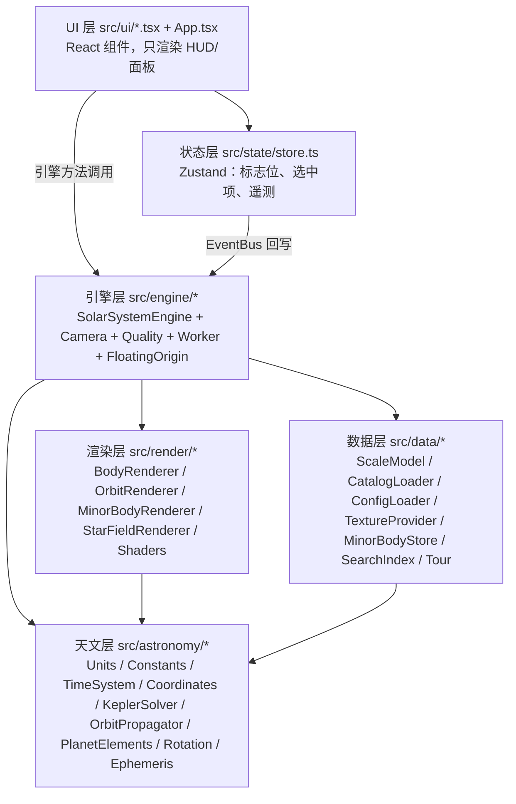
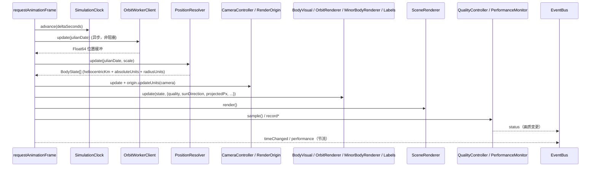
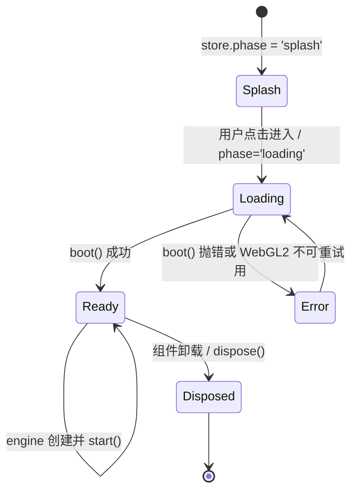

# 架构说明 (Architecture)

本文描述模块划分、数据流、事件总线契约、引擎生命周期与文件树。所有路径均相对仓库根目录 `/workspace/solarsystem`。

## 1. 分层与依赖方向

自上而下分为五层，依赖只向下（UI 不直接操作 three.js）：



- 天文层（`src/astronomy/`）是**纯计算**，不依赖 three.js，可在 Node/Vitest 中直接测试。
- 引擎层（`src/engine/`）拥有 three.js 场景、相机、画质与 Worker；是唯一的可变状态中心。
- 渲染层（`src/render/`）只负责把引擎给出的状态转成 GPU 资源，不含位置计算。
- UI 层（`src/ui/`）通过 `EventBus` 事件与引擎方法交互；`src/state/store.ts` 顶部注释明确：“engine instance 本身存放在模块级 holder，绝不复制进 React state”。

## 2. 模块一览

### 天文层 `src/astronomy/`

| 文件 | 职责 |
| --- | --- |
| `Units.ts` | 单位与格式化：`AU_KM = 149597870.7`、`DEG/RAD`、`normalizeAngle/wrapPi`、`formatDistance` 等 |
| `Constants.ts` | 物理常数：`GM_SUN_KM3_S2`、`SOLAR_RADIUS_KM`、`OBLIQUITY_J2000_RAD`、`J2000_JD`、`J2000_MJD`、`JULIAN_CENTURY_DAYS`、`SPEED_OF_LIGHT_KM_S`、`MOON_EARTH_MASS_RATIO`、`JD_UNIX_EPOCH`、`SATELLITE_MEAN_ELEMENT_EPOCH_JD` |
| `TimeSystem.ts` | 历元时钟：Meeus 第 7 章日期↔儒略日、`TIME_SCALE_PRESETS`、`SimulationClock`、`parseTimeInput`、支持范围 JD 625673.5–2816787.5 |
| `Coordinates.ts` | 向量/Mat3 运算、帧转换（`ECLIPTIC_TO_SCENE`、`bodyEquatorialFrameFromPole`、`planeRotationFromPole`、`angularSeparation`） |
| `KeplerSolver.ts` | 开普勒方程（椭圆/双曲）、近焦点→参考面旋转、平均运动、vis-viva 速度 |
| `OrbitPropagator.ts` | Mode B 传播：`propagateRelativeKm`、`sampleOrbitPath`、`resolveMeanMotion`、参考面处理 |
| `PlanetElements.ts` | Mode B 行星：JPL/Standish 根数求值、地月质心分裂、`keplerPlanetHeliocentricKm`、`keplerMoonGeocentricKm` |
| `Rotation.ts` | 天体朝向：`bodyOrientationBodyToEcliptic`、`rotationPhaseRad`、`SUN_ROTATION` |
| `Ephemeris.ts` | Mode A：`AstronomyEngineEphemerisSource`、`planetEquatorialFrame`、EQJ→黄道旋转 |
| `__tests__/*.test.ts` | `Coordinates`、`EphemerisValidation`、`KeplerSolver`、`TimeSystem` 四组单测（共 60 用例） |

### 数据层 `src/data/`

| 文件 | 职责 |
| --- | --- |
| `ScaleModel.ts` | 三种尺度模式、`createScaleTransform`、`satelliteSystemFactor`、`formatMagnification`、`SCALE_MODES` 文案 |
| `CatalogLoader.ts` | 一次性加载 `manifest.json` → `manifest.catalogFile`（版本化目录，如 `catalog-v20260929.json`）→ `planet-elements.json` → 恒星 → 小天体，按真实完成度上报进度，小天体/恒星失败可降级 |
| `ConfigLoader.ts` | `DEFAULT_EXHIBITION_CONFIG`、`mergeExhibitionConfig`（类型校验）、`loadExhibitionConfig`（失败不致命）、`dataUrl` |
| `MinorBodyStore.ts` | 小天体扁平类型化数组：`elements`（Float32，stride 8）、`records`、`selectIndices`、`loadMinorBodies` |
| `SearchIndex.ts` | MiniSearch 索引，覆盖名称/中文名/官方名/别名，含 `search` 与 `autoSuggest` |
| `TextureProvider.ts` | 按需加载贴图、画质档解析、程序化贴图（确定性值噪声）、有界缓存 + `dispose()` |
| `Tour.ts` | `TOUR_STOPS`（13 站）、`AUTO_DEMO_STOPS`（8 站）、`DEFAULT_IDLE_SECONDS = 150` |

### 引擎层 `src/engine/`

| 文件 | 职责 |
| --- | --- |
| `SolarSystemEngine.ts` | 编排核心：拥有渲染器、相机、解析器、尺度、Worker 与各渲染层；驱动 RAF 帧循环 |
| `PositionResolver.ts` | 唯一的“天体在哪”来源：对全部编目天体求值并解出父子层级与渲染单位 |
| `CameraController.ts` | 五种相机模式、fly-to 电影式转场、浮动原点下的虚拟相机 |
| `Renderer.ts` | `SceneRenderer`：WebGLRenderer + EffectComposer（RenderPass/UnrealBloomPass/OutputPass）、上下文丢失恢复 |
| `FloatingOrigin.ts` | `RenderOrigin`：`updateUnits`、`relative`、`relativeFromWarped`、`parentRelative`、`writeFloat32` |
| `QualityController.ts` | `QUALITY_PROFILES` 与基于滑窗的 `sample()` 自适应降/升档 |
| `PerformanceMonitor.ts` | 帧时间、Worker/轨道/位置耗时滑动平均，`snapshot()` |
| `OrbitWorkerClient.ts` | Worker 的类型化封装与主线程回退 |
| `GraphicsCapability.ts` | WebGL 能力探测与降级提示 |
| `LabelRenderer.ts` | DOM 标签层：投影定位、优先级、重叠抑制、命中测试 |
| `EventBus.ts` | 类型化事件总线（见第 4 节） |

### 渲染层 `src/render/`

| 文件 | 职责 |
| --- | --- |
| `BodyRenderer.ts` | `BodyVisual`：一天体一个 Group（anchor + frame），LOD 分级、太阳辉光、大气壳、云层、行星环、标记点 |
| `OrbitRenderer.ts` | 两类轨道线：日心（float64 千米样本，逐帧重写为相机相对 float32）与母天体相对（一次构建、父级挂载） |
| `MinorBodyRenderer.ts` | 小天体单点云（一次 draw call），颜色按族群、尺寸按 H/直径 |
| `StarFieldRenderer.ts` | 相机挂载的单位球恒星层，B−V 色指数→RGB，无视差 |
| `Shaders.ts` | 全部 GLSL：太阳、辉光、大气、行星表面、点云、恒星 |

### Worker 与 UI

| 文件 | 职责 |
| --- | --- |
| `src/workers/orbit.worker.ts` | 小天体开普勒传播（`init/setSubset/update/orbitPath/dispose`），仅传回 Float64 位置缓冲 |
| `src/App.tsx` | 应用外壳：splash → loading → ready；编排面板与引擎回调 |
| `src/ui/useEngine.ts` | 创建/销毁引擎，接入事件总线，安装指针/键盘/触摸输入，驱动导览与自动演示，`ResizeObserver` |
| `src/ui/*.tsx` | `SplashScreen`、`LoadingScreen`、`Hud`、`Sidebar`、`Inspector`、`SearchPanel`、`SettingsPanel`、`TourPanel`、`PerformanceOverlay`、`ErrorBoundary` |
| `src/ui/formatters.ts` | 字段格式化；未知值统一渲染为 `暂无可靠数据` |
| `src/state/store.ts` | Zustand store 与引擎 holder（`setEngine/getEngine/requireEngine`） |
| `src/i18n/index.ts` | 中英文字典与 `createTranslator` |
| `src/styles/app.css` | HUD 样式、`--ui-scale`、触摸/4K/减弱动效/高对比度媒体查询 |

## 3. 数据流

**加载期（一次性，`src/App.tsx` 的 `boot`）**

1. `loadExhibitionConfig()` 读取 `exhibition.config.json`（失败回退默认）。
2. `loadCatalog({ enableMinorPlanets, enableStarfield, onProgress })` 顺序加载 manifest → catalog → planet-elements → 恒星 → 小天体，并构建 `bodyById`、`childrenByParent`。
3. `new CatalogSearchIndex(bodies, minorBodies)` 建索引。
4. store 切到 `phase: 'ready'`，`useEngine` 创建 `SolarSystemEngine`。

**每帧（`SolarSystemEngine.frameStep`，由 `requestAnimationFrame` 驱动）**



顺序（与 `src/engine/SolarSystemEngine.ts` 顶部注释一致）：1 推进时钟 → 2 向 Worker 请求小天体位置 → 3 解析编目天体 → 4 更新相机与浮动原点 → 5 更新各天体视觉（LOD、朝向、贴图流式加载）→ 6 重写轨道线、小天体点云与标签 → 7 渲染 → 8 喂给画质控制器与性能监视器。

**UI 交互（回调 → 引擎 → 事件 → store）**

`Hud`/`Sidebar`/`Inspector` 的按钮调用 `App.tsx` 中的回调，经 `getEngine()` 调用引擎方法；引擎通过 `EventBus.emit` 发事件，`useEngine` 中的订阅把结果写回 store，React 重新渲染。例如选择天体：`handleSelect(id)` → `engine.selectBody(id)` → `selectionChanged` → store 更新 `selectedId` 与 `bodyDescription`。

## 4. 事件总线契约

`src/engine/EventBus.ts` 定义类型化事件；`EventBus.emit` 对每个 handler 做 try/catch（单个 handler 抛错不影响其他）。**没有 preventDefault 式否决机制**：UI 只观察与请求，引擎拥有渲染循环。

| 事件 | 载荷 | 语义 |
| --- | --- | --- |
| `selectionChanged` | `{ id: string \| null }` | 天体被点击或程序化选中；`minor:<index>` 表示小天体 |
| `trackingChanged` | `{ id: string \| null }` | 相机锁定目标变化（同步 HUD 追踪标签） |
| `timeChanged` | `{ julianDate, timeScale, paused }` | 仿真时间前进；节流至 ≤ 200 ms |
| `cameraModeChanged` | `{ mode: string }` | 相机模式变化 |
| `scaleModeChanged` | `{ mode: string }` | 尺度模式变化 |
| `flyToStarted` | `{ id, fromDistanceKm }` | fly-to 转场开始 |
| `flyToFinished` | `{ id }` | fly-to 转场结束 |
| `contextLost` | `Record<string, never>` | 渲染器丢失 WebGL 上下文 |
| `contextRestored` | `Record<string, never>` | 上下文恢复、GPU 资源已重建 |
| `performance` | `Record<string, unknown>` | 性能快照；启用覆盖层时约 2 Hz |
| `status` | `{ level: 'info'\|'warn'\|'error'; message: string }` | 加载/资产通知、画质变更、降级消息 |
| `labelFocus` | `{ id: string }` | 标签层回退用（当前引擎以 DOM 标签为主） |

事件以 `engine.events.on(name, handler)` 订阅，返回取消订阅函数。

## 5. 引擎生命周期



**创建（`new SolarSystemEngine(options)`）**

1. 构建 `SceneRenderer`（WebGL2、对数深度缓冲、ACES 色调映射、bloom），注册上下文丢失/恢复回调。
2. 构建 `QualityController`、`ScaleTransform`、`CameraController`、`PositionResolver`（注入 `AstronomyEngineEphemerisSource`）。
3. 构建 `TextureProvider`、`LabelRenderer`（创建 `.label-layer` DOM）。
4. 若启用小天体：创建 `MinorBodyRenderer`，`worker.init(elements, subset, GM_SUN)`，建立 `minorItems`。
5. 若启用恒星：创建 `StarFieldRenderer` 并挂到相机。
6. `createBodyVisuals()`：对每个 star/planet/dwarfPlanet/moon 创建 `BodyVisual`；卫星挂到母天体 anchor。
7. `applyQuality()`、`setLanguage()`、`frameOverview()`，发出首个 `scaleModeChanged`。

**运行**：`start()` 启动 RAF 循环（`lastFrameTime` 与 delta 上限 0.25 s）；`stop()` 取消 RAF。

**销毁（`dispose()`）**：标记 `disposed`，`stop()`，`worker.dispose()`，逐个 `visual.dispose()`，`orbitRenderer/minorBodyRenderer/starRenderer/labelRenderer/textures/renderer` 依次释放，`events.clear()`。`useEngine` 在卸载时先执行输入监听清理，再调用 `engine.dispose()`。

上下文丢失时 `SceneRenderer` 调用 `contextLost` 回调；恢复时引擎销毁并重建全部 `BodyVisual`（不清空编目状态），再发 `contextRestored`。

## 6. 文件树

```
solarsystem/
├── index.html
├── package.json
├── vite.config.ts
├── vitest.config.ts
├── tsconfig.json / tsconfig.app.json / tsconfig.node.json
├── .oxlintrc.json
├── data/
│   └── sources/            # 权威/策展数据（update-* 输出）
│       ├── body-names.json
│       ├── jpl-satellite-mean-elements.json
│       ├── minor-bodies.json
│       ├── planet-orientation.json
│       ├── planet-physical.json
│       ├── planets-jpl-approx.json
│       └── satellites.json
├── public/
│   ├── exhibition.config.json
│   ├── favicon.svg
│   ├── icons.svg
│   └── data/
│       ├── catalog/        # catalog-vYYYYMMDD.json（manifest.catalogFile 指向） / planet-elements.json / minor-bodies.{json,bin} / manifest.json
│       ├── stars/          # stars.bin / stars.json
│       └── textures/       # 行星表面贴图 + textures.json
├── scripts/
│   ├── lib/io.mjs
│   ├── build-catalog.mjs
│   ├── update-minor-bodies.mjs
│   ├── update-planets.mjs
│   ├── update-satellites.mjs
│   ├── update-stars.mjs
│   └── update-textures.mjs
└── src/
    ├── App.tsx
    ├── main.tsx
    ├── astronomy/
    │   ├── Constants.ts  Coordinates.ts  Ephemeris.ts  KeplerSolver.ts
    │   ├── OrbitPropagator.ts  PlanetElements.ts  Rotation.ts  TimeSystem.ts  Units.ts
    │   └── __tests__/ Coordinates.test.ts  EphemerisValidation.test.ts  KeplerSolver.test.ts  TimeSystem.test.ts
    ├── data/
    │   ├── CatalogLoader.ts  ConfigLoader.ts  MinorBodyStore.ts  ScaleModel.ts
    │   ├── SearchIndex.ts  TextureProvider.ts  Tour.ts
    ├── engine/
    │   ├── CameraController.ts  EventBus.ts  FloatingOrigin.ts  GraphicsCapability.ts
    │   ├── LabelRenderer.ts  OrbitWorkerClient.ts  PerformanceMonitor.ts  PositionResolver.ts
    │   ├── QualityController.ts  Renderer.ts  SolarSystemEngine.ts
    ├── i18n/index.ts
    ├── render/
    │   ├── BodyRenderer.ts  MinorBodyRenderer.ts  OrbitRenderer.ts  Shaders.ts  StarFieldRenderer.ts
    ├── state/store.ts
    ├── styles/app.css
    ├── types/catalog.ts
    ├── ui/
    │   ├── ErrorBoundary.tsx  Hud.tsx  Inspector.tsx  LoadingScreen.tsx  PerformanceOverlay.tsx
    │   ├── SearchPanel.tsx  SettingsPanel.tsx  Sidebar.tsx  SplashScreen.tsx  TourPanel.tsx
    │   ├── formatters.ts  useEngine.ts
    └── workers/orbit.worker.ts
```

`npm run verify:ephemeris`（`scripts/verify-ephemeris.mjs`）是独立于 Web 应用的科学验证入口：它自行实现开普勒传播并与 astronomy-engine 逐颗比较行星位置，输出误差表；同一模型另有 `src/astronomy/__tests__/EphemerisValidation.test.ts` 在 Vitest 中覆盖。